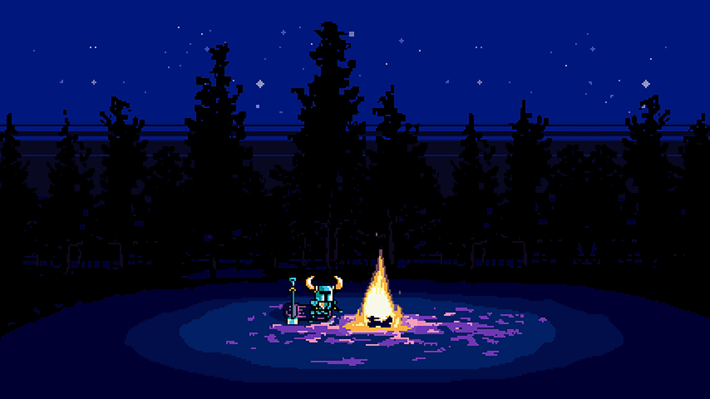

  

  
  
  
  
  
  

##

- <i>Reach me at: **[aniketsingh4269@gmail.com](mailto:aniketsingh4269@gmail.com)**</i>

- <i>Curious about various different stuffs.</i>

<!--   -->

## Connect with me:

  

## Tools I use:

  
  
  
  
  
  
  
  
  
  
  

##

  
 

